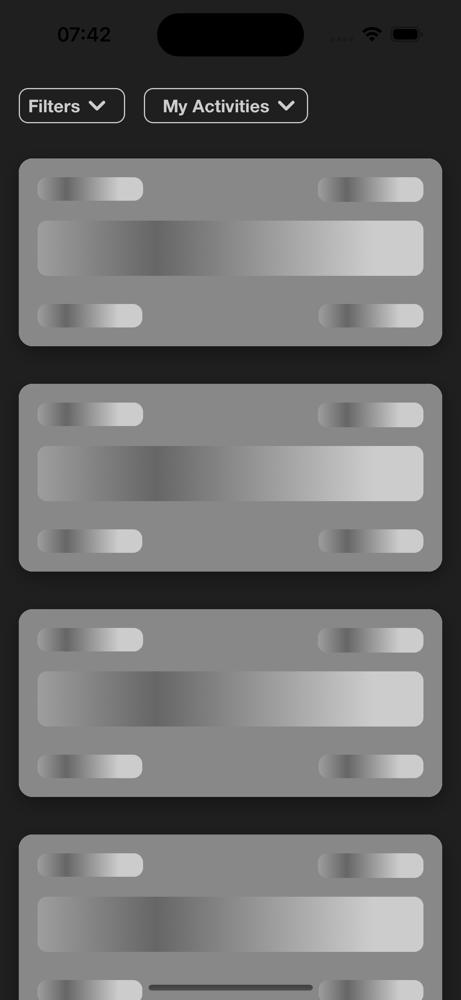
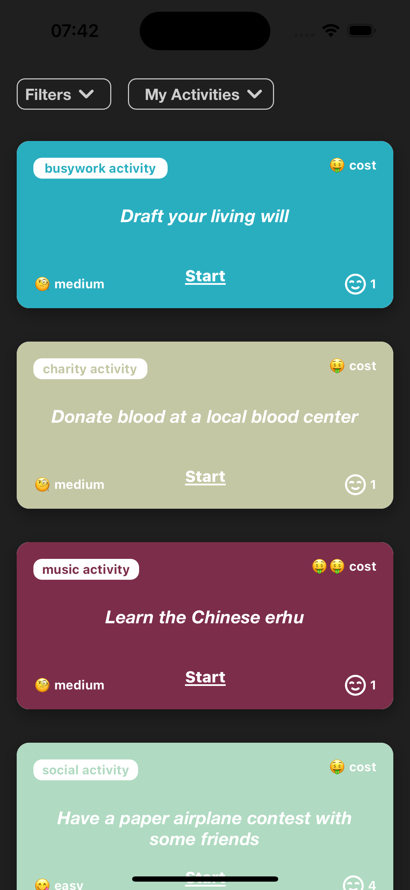
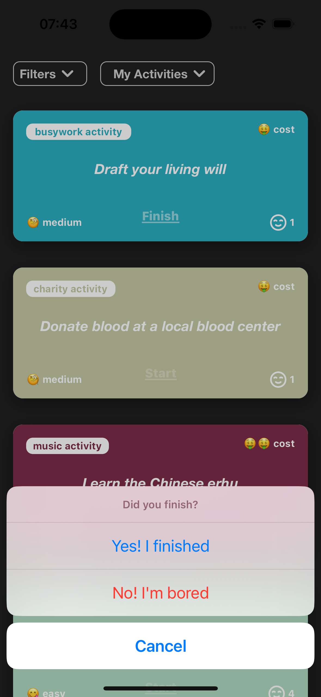
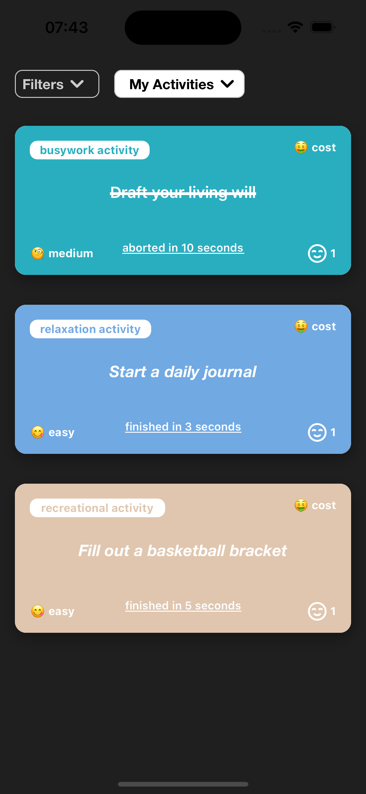
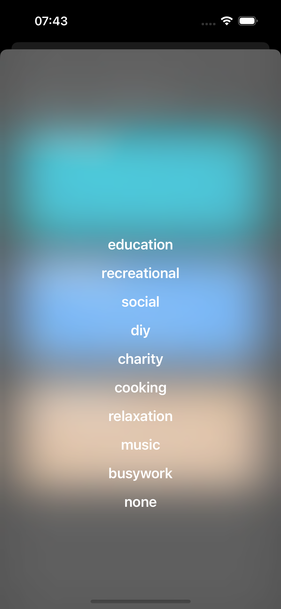
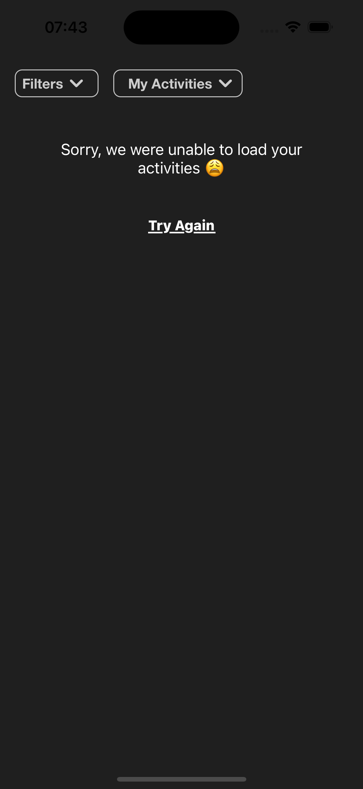
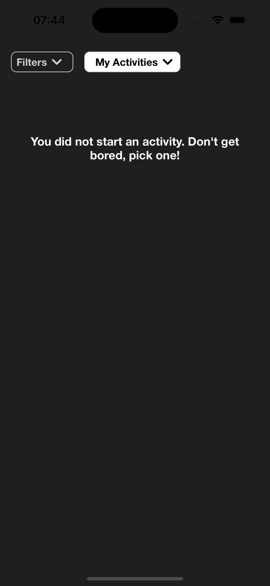

# iOS Bored App

## Requisitos mínimos para Executar:

- MacOS Ventura 13.1 +
- iOS 16
- Swift 5
- XCode 14.2

## Como executar o projeto:

O projeto não tem biblioteca externa, por isso não foi utilizado cocoapods/spm. Basta abrir o arquivo BoredApp.xcodeproj

## Objetivo:

O objetivo deste projeto é mostrar para o usuário uma lista de atividades aleatórias, permitir que ele inicie uma atividade e veja o seu progresso.

## Arquitetura: 

O projeto utiliza Clean Architecture. Sendo assim, cada feature é composta por algumas camadas:

- Worker
- Interactor 
- Presenter
- ViewController
- Router

o Worker busca da API https a lista de atividades, e também é responsável por salvar localmente (coredata)

o Interactor contém as regras de negócios, requisita os dados para o Worker, e entrega para o presenter formatar o Data do jeito que a view espera.

o Router é responsável pela navegação entre telas.

a ViewController é responsável por exibir a interface do usuário e também tratar as suas entradas. 

## Débitos Técnicos:

Segue uma pequena lista de itens bem importantes que ficaram faltando implementar:

- Testes unitários. Implementar testes em cada camada (interactor, view, presenter, worker, router)

- Mover strings para um arquivo Localizable

- tratar Dark Mode

## Telas do Projeto

